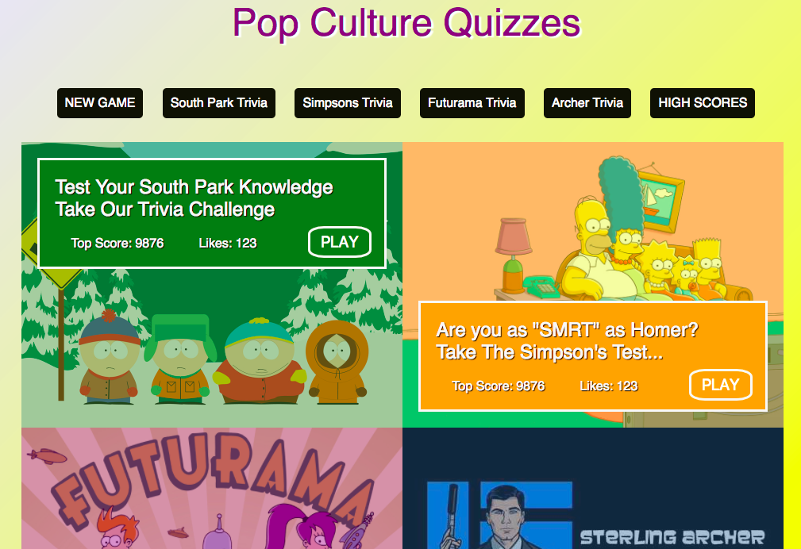

# Quiz Page #

### Please check it out live on gh-pages: https://d34n5.github.io/quiz-page ###

### Simple Web App made with Sass & Bourbon ###

### Week 3 CSS Independent Project by Dean Scelza @ Epicodus, 12-9-16 ###

#### Description & Technologies Used ####
This single page quiz card web app challenges users to test their knowledge in some arcane subjects.
Focus on Sass nesting, variables and media queries.
Also uses Bourbon mixins, extends and functions.

### Installation & Set-Up ###
1. Clone the repository: https://github.com/d34n5/quiz-page
2. Use your preferred browser to open index.html

#### Known Bugs ####
There are no known bugs.  However, I encourage both feedback and criticism: If you have ANY concerns, questions or suggestions, feel free to contact me at:  deanscelza@gmail.com

## License ##
**Copyright (c) 2016, Dean Scelza @ Epicodus**
This software is licensed under the MIT license.
